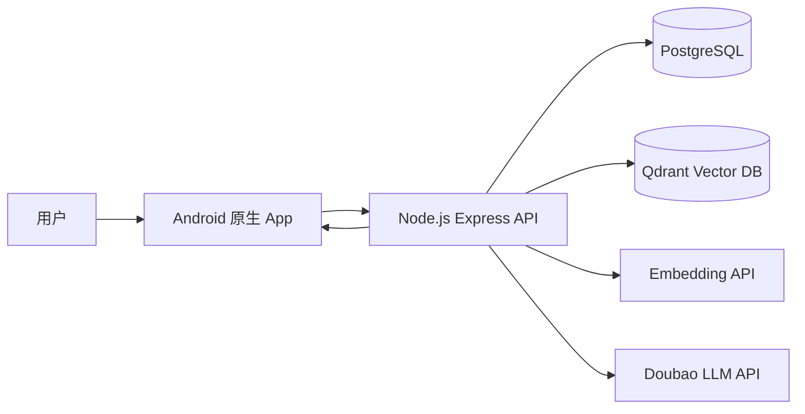
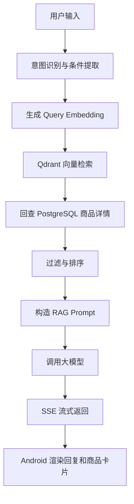
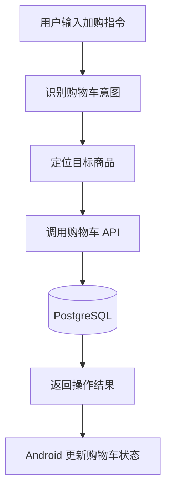
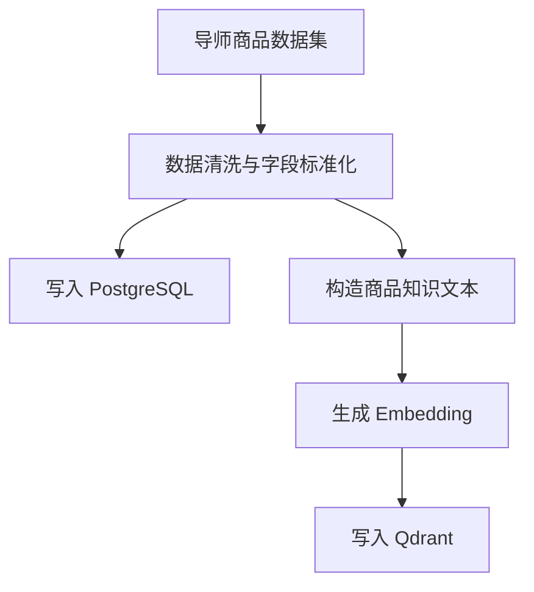

# 抖选选 — 项目概述

> 基于 RAG 的对话式电商导购 Android App，通过自然语言帮助用户完成商品推荐、筛选、对比、加购与模拟下单。

## 目录

- [1. 产品概述](#1-产品概述)
- [2. 问题背景](#2-问题背景)
- [3. 目标用户与使用场景](#3-目标用户与使用场景)
- [4. 产品范围](#4-产品范围)
- [5. MVP 功能范围](#5-mvp-功能范围)
- [6. 功能分层路线](#6-功能分层路线)
- [7. 商品数据与知识库](#7-商品数据与知识库)
- [8. 技术架构](#8-技术架构)
- [9. RAG 与 Agent 设计](#9-rag-与-agent-设计)
- [10. 数据模型](#10-数据模型)
- [11. API 设计](#11-api-设计)
- [12. Android 端交互设计](#12-android-端交互设计)
- [13. 系统流程图](#13-系统流程图)
- [14. 开发顺序](#14-开发顺序)
- [15. 风险与待定事项](#15-风险与待定事项)
- [16. 推荐仓库结构](#16-推荐仓库结构)
- [17. 项目链接](#17-项目链接)
- [18. 当前状态](#18-当前状态)

---

## 1. 产品概述

**抖选选** 是一个基于 RAG 的对话式电商导购 Android App。用户可以通过自然语言描述购物需求，系统根据商品知识库检索候选商品，并由大模型生成推荐理由、商品对比、筛选结果和购物建议。

项目采用类似 ChatGPT 的对话式交互。用户进入 App 后主要看到 AI 导购聊天窗口。商品卡片不会默认铺满首页，而是在用户提出购物需求、筛选条件、对比请求或加购意图后，嵌入在 AI 回复中展示。

### 产品定位

抖选选面向普通购物 App 场景，重点解决用户在商品选择过程中的信息筛选、需求表达和决策困难问题。

系统不是单纯展示商品列表，而是通过 AI Agent 理解用户意图，并结合 RAG 检索结果生成可解释的推荐结果。

### 核心价值

- 用自然语言对话替代复杂筛选条件。
- 用 RAG 检索商品库，降低大模型编造商品、价格、库存和优惠信息的风险。
- 用商品卡片连接推荐结果和用户操作。
- 用购物车能力把导购咨询延伸到交易前流程。
- 支持从基础推荐逐步扩展到多轮对话、反选排除、多商品对比、多模态找货和模拟下单。

### 一句话介绍

**抖选选是一个基于 RAG 的对话式电商导购 App，通过自然语言帮助用户完成商品推荐、对比和加购。**

---

## 2. 问题背景

传统电商 App 通常依赖搜索框、分类页、筛选器和商品详情页帮助用户完成购物决策。该模式在明确搜索场景下有效，但在用户需求模糊、条件复杂或需要对比解释时，使用成本较高。

### 当前痛点

1. **用户需求经常是模糊的**

   例如：

   - “推荐适合油皮的护肤品”
   - “有没有适合通勤的耳机”
   - “想买一双轻便的运动鞋”
   - “有没有适合宿舍囤货的食品”

   这类需求不容易直接转化为固定筛选条件。

2. **商品信息分散**

   商品的价格、规格、功效、适用场景、品牌、评价和库存信息通常分散在标题、详情、标签和评论中。用户需要自行阅读、筛选和比较。

3. **传统筛选器无法覆盖复杂表达**

   用户可能提出否定条件、组合条件或场景化需求，例如：

   - “不要含酒精的”
   - “预算 500 以内”
   - “适合夏天通勤”
   - “除了某品牌还有什么”
   - “这两个哪个更适合运动？”

4. **商品推荐缺少解释**

   普通推荐列表通常只展示结果，不解释为什么推荐。用户仍然需要自行判断商品是否符合自己的需求。

5. **大模型直接推荐存在幻觉风险**

   如果不接入商品库检索，大模型可能生成不存在的商品、错误价格、错误库存、错误功效或虚假优惠信息。

### 项目回应

抖选选通过 Android 原生客户端、Node.js 后端、PostgreSQL、Qdrant 向量数据库和大模型 API 构建端到端 AI 导购链路：

```text
用户自然语言输入
→ 后端识别用户意图
→ 检索 Qdrant 商品向量库
→ 读取 PostgreSQL 商品结构化数据
→ 构造 RAG Prompt
→ 大模型生成导购回复
→ Android 端流式展示文本和商品卡片
→ 用户继续追问、对比、加购或下单
```

项目目标不是替代完整电商平台，而是在课程项目范围内实现一个可运行、可演示、可解释的 AI 导购闭环。

---

## 3. 目标用户与使用场景

### 3.1 目标用户

| 用户类型     | 主要需求             | 成功标准                 |
| -------- | ---------------- | -------------------- |
| 普通购物用户   | 用自然语言描述需求并获得推荐   | 推荐商品符合预算、类目、场景和偏好    |
| 选择困难用户   | 在多个商品之间进行对比      | 系统能说明差异、适用人群和推荐理由    |
| 有明确条件的用户 | 按价格、品牌、功效、场景筛选商品 | 系统能解析约束并返回符合条件的商品    |
| 移动端用户    | 在手机上完成咨询、浏览和加购   | 对话流畅，商品卡片清晰，可直接操作购物车 |

### 3.2 核心 JTBD

* 当我不知道买什么时，我想通过自然语言描述需求，让系统推荐合适商品。
* 当我有预算、品牌、功效或场景限制时，我想让系统帮我筛选商品。
* 当我在多个商品之间犹豫时，我想看到结构化对比和推荐理由。
* 当我决定购买时，我想直接把商品加入购物车，而不是重新搜索。
* 当我继续补充条件时，我希望系统能记住上下文并调整推荐结果。

### 3.3 典型使用场景

### 场景一：单轮模糊推荐

用户输入：

```text
推荐一款适合油皮的护肤品
```

系统行为：

1. 识别用户需要“美妆护肤”类商品。
2. 提取关键词：油皮、护肤品。
3. 检索商品知识库。
4. 返回 2–3 个候选商品。
5. 给出推荐理由。
6. 展示商品卡片。

### 场景二：条件筛选

用户输入：

```text
200 元以下的蓝牙耳机有哪些？
```

系统行为：

1. 识别类目为“数码电子”。
2. 提取价格条件：小于等于 200 元。
3. 检索并过滤候选商品。
4. 返回符合价格条件的商品卡片。

### 场景三：多轮追问

用户输入：

```text
帮我推荐跑鞋
```

系统回复：

```text
请问你更看重轻量、缓震、耐磨还是日常通勤？
```

用户补充：

```text
要轻量的，预算 500 以内
```

系统行为：

1. 保留前文“跑鞋”上下文。
2. 加入“轻量”和“预算 500 以内”约束。
3. 重新检索商品。
4. 返回更精确的推荐。

### 场景四：反选与排除

用户输入：

```text
推荐防晒霜，但不要含酒精的
```

系统行为：

1. 识别类目为“美妆护肤”。
2. 提取正向需求：防晒霜。
3. 提取否定条件：不要含酒精。
4. 从候选集中排除不符合条件的商品。
5. 生成推荐说明。

### 场景五：商品对比

用户输入：

```text
A 和 B 这两款耳机哪个更适合通勤？
```

系统行为：

1. 获取 A、B 两款商品信息。
2. 按价格、续航、重量、降噪、适用场景进行对比。
3. 给出结论性推荐。
4. 展示对比表或结构化回复。

### 场景六：购物车操作

用户输入：

```text
把第二个加到购物车
```

系统行为：

1. 识别加购意图。
2. 定位上一轮推荐结果中的第二个商品。
3. 调用购物车接口。
4. 返回加购结果。
5. Android 端更新购物车状态。

---

## 4. 产品范围

### 4.1 核心实体

### 用户 User

表示 App 使用者。

主要能力：

* 注册
* 登录
* 查看会话
* 管理购物车
* 模拟下单

### 商品 Product

表示商品库中的一个商品。

基础字段：

* 商品 ID
* 商品名称
* 类目
* 价格
* 详情描述
* 主图 URL
* 库存
* 标签
* 来源
* 创建时间
* 更新时间

### 商品向量 Product Embedding

表示商品文本信息的向量化结果，用于语义检索。

向量来源：

* 商品名称
* 类目
* 商品详情
* 标签
* 卖点
* 可选评论摘要

### 对话 Session

表示一次用户与 AI 导购的连续交互。

主要能力：

* 保存上下文
* 记录用户需求
* 保存推荐结果
* 支持多轮追问

### 消息 Message

表示对话中的一条消息。

消息类型：

* 用户文本消息
* AI 文本回复
* 商品推荐卡片
* 系统操作结果
* 购物车状态提示

### 购物车 Cart

表示用户待购买商品集合。

主要能力：

* 加入商品
* 删除商品
* 修改数量
* 查看购物车
* 清空购物车
* 生成模拟订单

### 订单 Order

表示模拟下单结果。

MVP 阶段可作为扩展功能实现，不接入真实支付。

---

### 4.2 当前范围

### In Scope

* Android 原生 App
* 用户注册与登录
* AI 导购聊天窗口
* 文本输入
* AI 流式回复
* 商品卡片展示
* 商品详情页
* RAG 商品检索
* PostgreSQL 商品数据存储
* Qdrant 向量检索
* 购物车基础功能
* 多轮对话上下文
* 反选与排除条件
* 多商品对比
* 模拟下单流程
* 基础错误处理
* 基础技术文档

### Out of Scope for MVP

* 真实支付
* 真实物流
* 真实商家后台
* 真实用户地址校验
* 大规模推荐系统训练
* 真实广告投放系统
* 真实订单履约
* 多端同时支持 iOS 和 Android
* 完整运营后台

---

## 5. MVP 功能范围

MVP 目标是先跑通最小闭环：

```text
Android 对话输入
→ 后端接收请求
→ RAG 检索商品
→ 大模型生成回复
→ SSE 流式返回
→ Android 展示 AI 回复和商品卡片
→ 用户加入购物车
```

### 5.1 客户端 MVP

* Android 原生 App
* Kotlin 开发
* 登录 / 注册页面
* 对话页面
* 文本输入框
* 消息列表
* AI 流式回复渲染
* 商品卡片组件
* 商品详情页
* 购物车页面
* 加入购物车按钮
* 基础加载状态
* 基础错误提示

### 5.2 后端 MVP

* Node.js + TypeScript + Express
* 用户注册 / 登录 API
* JWT 鉴权
* 商品数据 API
* 商品检索 API
* 聊天 API
* SSE 流式返回
* PostgreSQL 结构化数据存储
* Qdrant 向量数据库
* 商品数据导入脚本
* Embedding 生成脚本
* RAG Prompt 构造
* 大模型 API 调用
* 购物车 CRUD API

### 5.3 模型能力 MVP

* 理解基础购物意图
* 支持单轮模糊推荐
* 支持条件筛选
* 基于检索结果生成推荐理由
* 回复中引用库内商品
* 不编造不存在的商品、价格、库存和优惠信息
* 无结果时明确说明未检索到合适商品

---

## 6. 功能分层路线

### 6.1 基础功能

基础功能是必须完成部分。

| 功能     | 说明                        |
| ------ | ------------------------- |
| 单轮模糊推荐 | 用户输入“推荐护肤品”等模糊需求，系统返回商品推荐 |
| 条件筛选   | 支持价格、类目、关键词等基础条件          |
| 商品卡片   | 在 AI 回复中展示商品图片、名称、价格和操作按钮 |
| 流式回复   | Android 端逐步渲染 AI 回复内容     |
| 商品详情   | 点击商品卡片进入详情页               |
| 基础加购   | 用户可以把商品加入购物车              |
| 登录注册   | 支持基本用户身份识别                |

### 6.2 进阶功能

进阶功能在基础闭环完成后实现。

| 功能    | 说明                    |
| ----- | --------------------- |
| 多轮上下文 | 支持“再便宜点”“换一个品牌”等追问    |
| 反选与排除 | 支持“不要含酒精”“除了某品牌”等否定条件 |
| 多商品对比 | 支持 2–3 个商品的结构化对比      |
| 对话式加购 | 用户可以说“把第二个加到购物车”      |
| 购物车管理 | 支持删除商品、修改数量、查看购物车     |

### 6.3 高级功能

高级功能根据开发进度选择实现。

| 功能         | 说明                     |
| ---------- | ---------------------- |
| 模拟下单       | 汇总购物车并生成模拟订单           |
| 语音输入       | Android 端采集语音并转成文本     |
| TTS 播报     | AI 回复支持语音朗读            |
| 图片找货       | 上传图片后识别商品特征并检索相似商品     |
| 热门查询缓存     | 对高频查询进行缓存，降低延迟         |
| 首 Token 优化 | 优化 Prompt 和调用链路，降低首字延迟 |

---

## 7. 商品数据与知识库

### 7.1 初始数据来源

项目初期使用导师提供的数据集。

初始类目包括：

* 美妆护肤
* 数码电子
* 服饰运动
* 食品生活

每个类目可包含若干商品样例，总量预计为 50–100 条。

### 7.2 后续数据扩展

后续可以扩展为：

* 从公开电商页面采集商品数据
* 对采集数据进行清洗和脱敏
* 扩充商品详情字段
* 增加评论摘要
* 增加商品标签
* 增加多模态图片信息

### 7.3 商品基础字段

```text
Product
- id
- name
- category
- price
- description
- imageUrl
- stock
- brand
- tags
- source
- createdAt
- updatedAt
```

### 7.4 商品知识文本构造

每个商品会被转换为一段用于 embedding 的文本。

示例：

```text
商品名：清透控油洁面乳
类目：美妆护肤
品牌：示例品牌
价格：89
标签：油皮、控油、洁面、温和
详情：适合油性肌肤和混合型肌肤，主打清洁和控油，适合日常早晚使用。
库存：有货
```

### 7.5 Chunking 策略

由于每条商品数据较短，MVP 阶段采用“单商品单 Chunk”策略。

即：

```text
1 个商品 = 1 个可检索文档 = 1 条向量记录
```

后续如果商品详情、评论和图文内容变长，可以改为：

```text
商品基础信息 Chunk
商品详情 Chunk
评论摘要 Chunk
使用场景 Chunk
```

---

## 8. 技术架构

### 8.1 技术栈

| 层级        | 技术方案                           | 说明                  |
| --------- | ------------------------------ | ------------------- |
| 客户端       | Android Native + Kotlin        | 满足原生 App 要求         |
| UI        | Jetpack Compose 或 XML View     | 推荐 Jetpack Compose  |
| 后端        | Node.js + TypeScript + Express | 团队已有 Node.js 基础     |
| 关系型数据库    | PostgreSQL                     | 存储用户、商品、购物车、订单、会话   |
| 向量数据库     | Qdrant                         | 存储商品向量并支持语义检索       |
| Embedding | 待技术验证后确定                       | 可调用外部 Embedding API |
| LLM       | Doubao-Seed-2.0-lite           | 用于导购回复生成            |
| 流式通信      | SSE                            | 实现 AI 回复流式返回        |
| 鉴权        | JWT                            | 用于用户登录状态            |
| 数据导入      | Node.js Script                 | 导入导师数据集并生成向量        |
| 部署        | 待定                             | 可本地部署或云部署           |

### 8.2 架构选择说明

### Android 原生

课题要求客户端为 iOS 或 Android 原生 App。本项目选择 Android 原生，主要原因：

* Kotlin 适合 Android App 开发。
* Android 端可以展示原生聊天 UI、商品卡片和购物车页面。
* 后续可扩展语音输入、图片上传和端侧多模态采集。

### Node.js 后端

本项目选择 Node.js + TypeScript + Express 作为后端主技术栈。

原因：

* 团队已有 Node.js 使用基础。
* Node.js 可以完成 API 服务、数据库访问、SSE 流式返回、模型 API 调用和数据导入脚本。
* TypeScript 有利于维护接口类型和数据模型。
* 项目不强制要求 Python。

### PostgreSQL + Qdrant

本项目直接采用 PostgreSQL + Qdrant 的双存储方案。

分工如下：

```text
PostgreSQL:
- 用户
- 商品结构化信息
- 会话
- 消息
- 购物车
- 订单

Qdrant:
- 商品 embedding 向量
- productId
- category
- price
- tags 等检索 metadata
```

选择该方案的原因：

* PostgreSQL 适合存储结构化业务数据。
* Qdrant 是专用向量数据库，便于后续扩展语义检索、多模态检索和更大数据规模。
* 商品数据和向量数据分离后，系统结构更接近生产级 RAG 架构。
* 后续如需替换 embedding 模型或扩展图片向量，不需要重构业务数据库。

---

## 9. RAG 与 Agent 设计

### 9.1 RAG 核心流程

```text
用户输入
→ 意图识别
→ 查询改写
→ Embedding 生成
→ Qdrant 向量检索
→ PostgreSQL 商品详情补全
→ 结果过滤与排序
→ Prompt 构造
→ LLM 生成回复
→ SSE 流式返回
→ Android 渲染文本和商品卡片
```

### 9.2 Agent 能力边界

Agent 负责：

* 理解用户购物需求
* 提取类目、预算、品牌、功效、场景等条件
* 判断是否需要追问
* 调用商品检索工具
* 调用购物车工具
* 生成推荐理由
* 生成商品对比
* 输出结构化操作结果

Agent 不允许：

* 编造商品库中不存在的商品
* 编造价格
* 编造库存
* 编造优惠券
* 编造商品功效
* 在没有检索结果时强行推荐

### 9.3 检索策略

### 基础检索

适用于：

```text
推荐一款适合油皮的洗面奶
```

流程：

1. 提取查询语义。
2. 生成 embedding。
3. 在 Qdrant 中按语义相似度召回候选商品。
4. 从 PostgreSQL 读取完整商品信息。
5. 交给 LLM 生成推荐理由。

### 条件过滤

适用于：

```text
200 元以下的蓝牙耳机有哪些？
```

流程：

1. 提取类目：数码电子。
2. 提取价格上限：200。
3. Qdrant 召回候选商品。
4. 使用 metadata 或 PostgreSQL 进行价格过滤。
5. 返回符合条件的商品。

### 反选排除

适用于：

```text
推荐防晒霜，但不要含酒精的
```

流程：

1. 提取正向需求：防晒霜。
2. 提取否定条件：不含酒精。
3. 检索候选商品。
4. 排除描述、标签或属性中含有酒精相关信息的商品。
5. 返回可解释推荐。

### 多轮上下文

适用于：

```text
用户：帮我推荐跑鞋
用户：要轻量的
用户：预算 500 以内
```

流程：

1. 保存会话上下文。
2. 将补充条件合并到当前购物意图。
3. 重新检索或重新排序候选商品。
4. 生成新的推荐结果。

### 购物车工具调用

适用于：

```text
把第二个加到购物车
```

流程：

1. 识别用户意图为加购。
2. 从最近一次推荐结果中定位第二个商品。
3. 调用 Cart API。
4. 返回操作结果。
5. 更新客户端购物车状态。

### 9.4 Prompt 约束

系统 Prompt 应包含以下规则：

```text
你是抖选选的 AI 电商导购助手。
你只能基于提供的商品检索结果进行推荐。
不得编造不存在的商品、价格、库存、品牌、优惠或功效。
如果检索结果不足，应说明当前商品库没有合适商品，并可以询问用户是否调整条件。
推荐商品时必须说明推荐理由。
当用户要求对比商品时，应从价格、特点、适用场景、优缺点等维度进行结构化比较。
当用户表达加购、删除、修改数量等意图时，应输出可被后端解析的操作指令。
```

---

## 10. 数据模型

### 10.1 PostgreSQL 数据模型

### User

```text
User
- id
- email
- passwordHash
- name
- createdAt
- updatedAt
```

### Product

```text
Product
- id
- name
- category
- brand
- price
- description
- imageUrl
- stock
- tags
- source
- createdAt
- updatedAt
```

### ChatSession

```text
ChatSession
- id
- userId
- title
- createdAt
- updatedAt
```

### Message

```text
Message
- id
- sessionId
- role
- content
- messageType
- metadata
- createdAt
```

### Cart

```text
Cart
- id
- userId
- createdAt
- updatedAt
```

### CartItem

```text
CartItem
- id
- cartId
- productId
- quantity
- createdAt
- updatedAt
```

### Order

```text
Order
- id
- userId
- status
- totalAmount
- createdAt
- updatedAt
```

### OrderItem

```text
OrderItem
- id
- orderId
- productId
- quantity
- priceSnapshot
```

### 10.2 Qdrant 向量数据结构

### Collection: products

```text
Vector Point
- id: productId
- vector: embedding
- payload:
  - productId
  - name
  - category
  - price
  - brand
  - tags
  - stock
```

### 10.3 数据同步规则

* PostgreSQL 是商品结构化数据的主数据源。
* Qdrant 只存储用于检索的向量和必要 metadata。
* 商品新增或更新后，需要重新生成 embedding 并 upsert 到 Qdrant。
* 商品删除后，需要同步删除 Qdrant 中对应向量。
* 检索结果必须回查 PostgreSQL，避免使用过期商品信息生成回复。

---

## 11. API 设计

### 11.1 Auth API

```text
POST /api/auth/register
POST /api/auth/login
GET  /api/auth/me
POST /api/auth/logout
```

### 11.2 Product API

```text
GET /api/products
GET /api/products/:id
GET /api/products/search
```

### 11.3 Chat API

```text
POST /api/chat/sessions
GET  /api/chat/sessions
GET  /api/chat/sessions/:id
GET  /api/chat/sessions/:id/messages
POST /api/chat/sessions/:id/messages
```

### Streaming Chat Endpoint

```text
POST /api/chat/stream
```

请求示例：

```json
{
  "sessionId": "session_001",
  "message": "推荐一款适合油皮的洗面奶"
}
```

响应方式：

```text
SSE stream
```

事件类型：

```text
message_delta
product_cards
tool_result
done
error
```

### 11.4 Cart API

```text
GET    /api/cart
POST   /api/cart/items
PATCH  /api/cart/items/:itemId
DELETE /api/cart/items/:itemId
DELETE /api/cart
```

### 11.5 Order API

```text
POST /api/orders/preview
POST /api/orders
GET  /api/orders
GET  /api/orders/:id
```

### 11.6 RAG / Admin API

MVP 阶段可仅供开发使用。

```text
POST /api/admin/products/import
POST /api/admin/products/:id/reindex
POST /api/admin/products/reindex-all
```

---

## 12. Android 端交互设计

### 12.1 页面结构

### 登录页

功能：

* 邮箱输入
* 密码输入
* 登录
* 注册入口
* 错误提示

### 对话页

功能：

* 消息列表
* 用户消息气泡
* AI 消息气泡
* 流式文字渲染
* 商品卡片横向或纵向展示
* 输入框
* 发送按钮
* 购物车入口

### 商品卡片

字段：

* 商品图片
* 商品名
* 价格
* 简短推荐理由
* 查看详情按钮
* 加入购物车按钮

### 商品详情页

字段：

* 商品主图
* 商品名称
* 类目
* 品牌
* 价格
* 库存
* 详情描述
* 标签
* 加入购物车按钮

### 购物车页

功能：

* 查看已加购商品
* 修改数量
* 删除商品
* 查看总价
* 模拟下单按钮

### 订单确认页

功能：

* 展示商品清单
* 展示总价
* 使用默认模拟地址
* 确认下单
* 展示下单结果

### 12.2 交互原则

* 对话页作为主入口。
* 用户没有提出购物需求时，不主动展示大量商品。
* 商品卡片只在推荐、对比、筛选或购物车操作相关场景出现。
* AI 回复需要和商品卡片同步展示。
* 加购成功后需要有明确反馈。
* 无检索结果时，应提示用户调整条件。

---

## 13. 系统流程图

### 13.1 高层架构



### 13.2 RAG 检索流程



### 13.3 购物车操作流程



### 13.4 数据导入与索引流程



---

## 14. 开发顺序

## Phase 1 — 项目基础

* 初始化 Git 仓库
* 建立 `/client` 和 `/server` 目录
* 初始化 Android 项目
* 初始化 Node.js + TypeScript + Express 后端
* 配置 PostgreSQL
* 配置 Qdrant
* 设计环境变量
* 编写基础 README

## Phase 2 — 数据与检索

* 整理导师商品数据集
* 设计 Product 表
* 编写商品导入脚本
* 生成商品知识文本
* 调用 embedding 模型生成向量
* 写入 Qdrant
* 实现基础语义检索
* 实现 PostgreSQL 商品详情回查

## Phase 3 — RAG 后端

* 实现聊天 API
* 实现 RAG Prompt 构造
* 接入 Doubao LLM API
* 实现 SSE 流式输出
* 实现商品卡片结构化返回
* 增加无结果处理
* 增加基础错误处理

## Phase 4 — Android MVP

* 登录 / 注册页面
* 对话页面
* 消息列表
* 输入框
* SSE 客户端接收
* 流式文本渲染
* 商品卡片组件
* 商品详情页
* 基础加载和错误状态

## Phase 5 — 购物车闭环

* 设计 Cart / CartItem 表
* 实现购物车 API
* Android 购物车页面
* 商品卡片加购按钮
* 对话式加购
* 删除商品
* 修改数量
* 模拟订单预览

## Phase 6 — 进阶 Agent 能力

* 多轮上下文记忆
* 反选和排除条件
* 多商品对比
* 查询改写
* 检索结果重排序
* Prompt 优化

## Phase 7 — 高级功能与优化

* 模拟下单
* 语音输入
* TTS 语音播报
* 图片找货
* 热门查询缓存
* 首 Token 延迟优化
* UI 动效与体验打磨

---

## 15. 风险与待定事项

### 15.1 技术风险

### RAG 检索结果不准确

风险：

* 商品数据量少。
* 商品描述不完整。
* 用户表达和商品文本差异较大。

应对：

* 增加商品标签。
* 优化商品知识文本。
* 对类目、价格、品牌等条件做结构化过滤。
* 对无结果场景进行明确提示。

### 大模型幻觉

风险：

* 模型可能编造商品属性、价格、库存或优惠。

应对：

* Prompt 中明确禁止编造。
* 回复必须基于检索结果。
* 商品卡片数据以 PostgreSQL 为准。
* 无检索结果时不强行推荐。

### PostgreSQL 与 Qdrant 数据不同步

风险：

* 商品更新后向量未更新。
* 商品删除后 Qdrant 中仍保留旧向量。

应对：

* 统一通过 Product Service 修改商品。
* 商品变更后触发 reindex。
* 提供 reindex-all 脚本。
* 检索后必须回查 PostgreSQL。

### Android SSE 接入复杂度

风险：

* 流式响应处理不稳定。
* 网络中断导致消息不完整。

应对：

* 先实现普通非流式 API 验证 RAG。
* 再接入 SSE。
* 增加 error 和 done 事件。
* 客户端处理重试和失败状态。

### 购物车对话式操作歧义

风险：

* “把这个加进去”中的“这个”可能指代不明确。
* “第二个”依赖上一轮推荐结果。

应对：

* 保存最近一次推荐商品列表。
* 无法确定目标商品时要求用户确认。
* 对工具调用结果进行二次校验。

### 15.2 产品待定事项

1. Embedding 模型最终选型。
2. Android UI 使用 Jetpack Compose 还是 XML View。
3. 商品详情页字段是否扩展评论摘要。
4. 是否需要简单后台管理页面。
5. 多模态功能是否进入最终 Demo。
6. 部署采用本地演示还是云端部署。
7. 是否需要保留公开电商页面采集脚本。

---

## 16. 推荐仓库结构

```text
shopmate/
  client/
    android/
      app/
      build.gradle
      settings.gradle

  server/
    src/
      app.ts
      server.ts

      config/
        env.ts
        database.ts
        qdrant.ts

      modules/
        auth/
          auth.controller.ts
          auth.service.ts
          auth.routes.ts

        users/
          user.model.ts
          user.service.ts

        products/
          product.model.ts
          product.service.ts
          product.routes.ts

        chat/
          chat.controller.ts
          chat.service.ts
          chat.routes.ts
          rag.service.ts
          prompt.builder.ts

        cart/
          cart.controller.ts
          cart.service.ts
          cart.routes.ts

        orders/
          order.controller.ts
          order.service.ts
          order.routes.ts

        vector/
          embedding.service.ts
          qdrant.service.ts
          vector-search.service.ts

      db/
        migrations/
        schema.sql
        seed.ts

      scripts/
        import-products.ts
        generate-embeddings.ts
        reindex-products.ts

      types/
        product.ts
        chat.ts
        cart.ts

      utils/
        errors.ts
        logger.ts
        sse.ts

    package.json
    tsconfig.json
    .env.example

  data/
    raw/
      beauty-skincare/
      digital-electronics/
      clothing-sports/
      food-lifestyle/

    processed/
      products.json

  context/
    project-overview.md
    current-feature.md
    ai-interaction.md
    coding-standards.md
    spec-implementation-order.md

  docs/
    figma-to-compose-reproduction-plan.md

  README.md
```

---

## 17. 项目链接

### 内部链接

* [产品概述](#1-产品概述)
* [问题背景](#2-问题背景)
* [MVP 功能范围](#5-mvp-功能范围)
* [技术架构](#8-技术架构)
* [RAG 与 Agent 设计](#9-rag-与-agent-设计)
* [API 设计](#11-api-设计)
* [开发顺序](#14-开发顺序)

### 外部链接待补充

* GitHub 仓库地址
* Demo 视频地址
* Android APK 下载地址
* 后端部署地址
* API 文档地址
* 数据集说明
* 项目演示脚本

---
